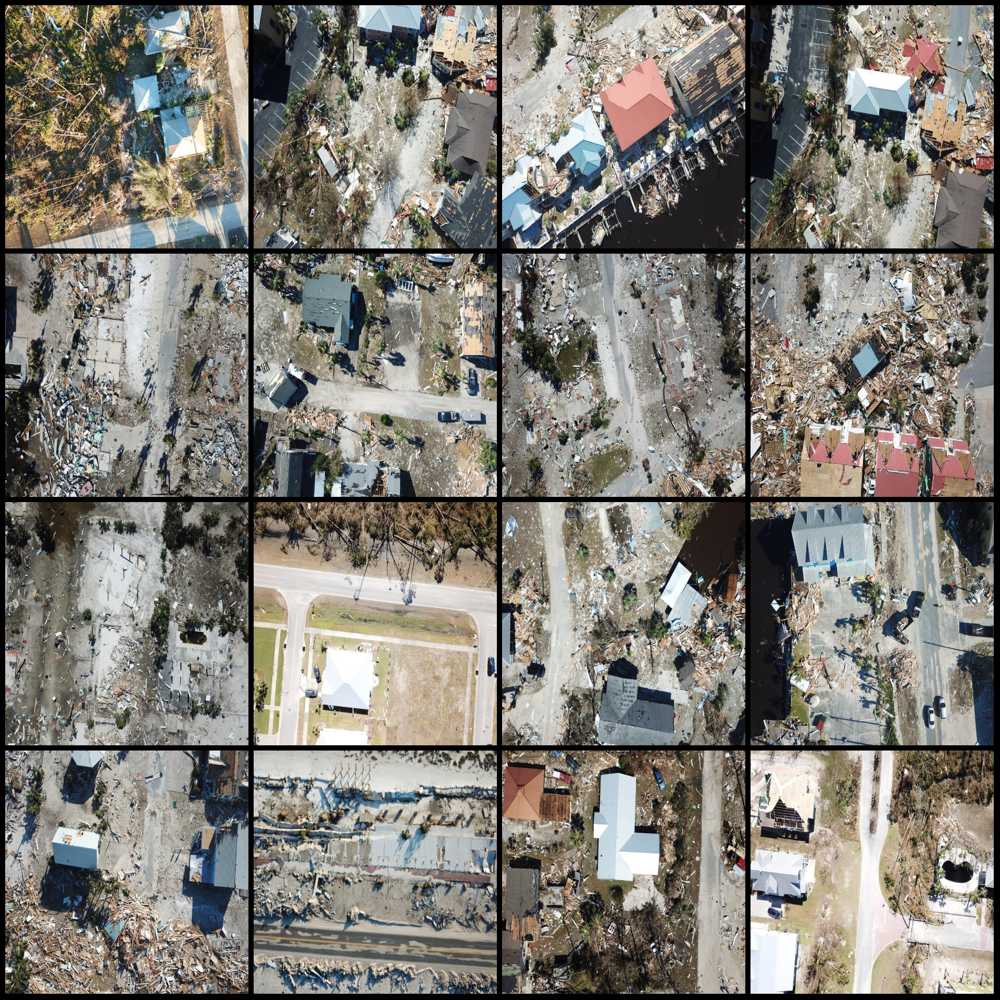
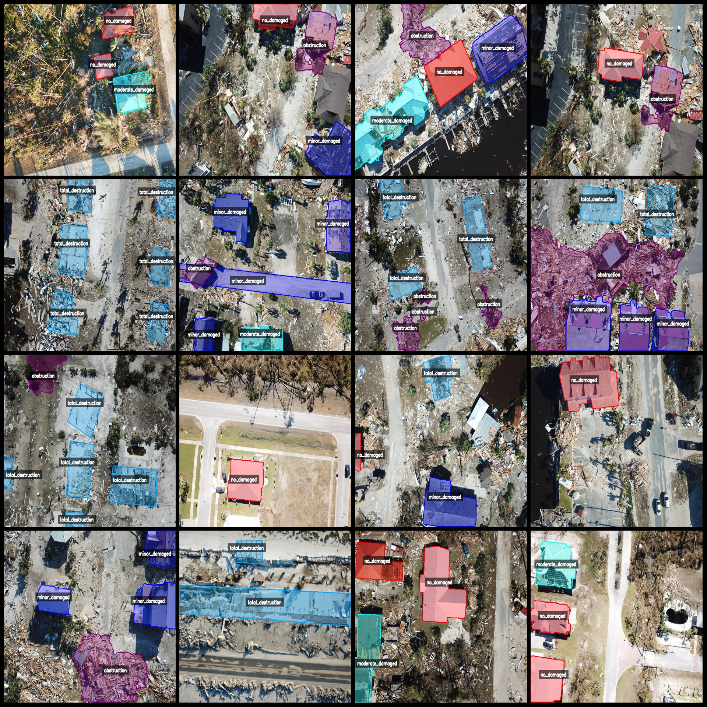
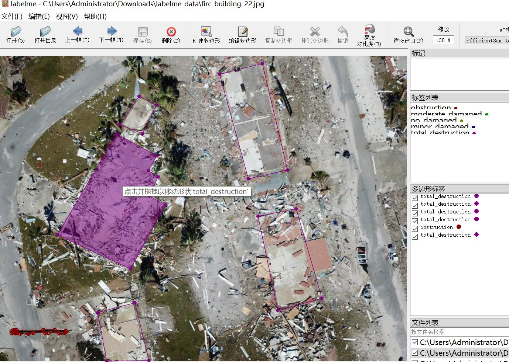

# Drone-Viewed Building Damage Identification and Segmentation Dataset (LabelMe format, 865 images in total, 6 categories)

Dataset format: LabelMe format (without mask files, only containing jpg images and corresponding json files)

Number of image files (number of jpg files): 865
Number of annotations (json file count): 865
Number of annotation categories: 6
Annotation category names: ["minor_damaged", "moderate_damaged", "no_damaged", "obstruction", "severe_damage", "total_destruction"]
Box counts for each category:
minor_damaged (mildly damaged): 661
moderate_damaged (moderately damaged): 266
no_damaged (undamaged): 874
obstruction (obstacle): 342
severe_damage (severely damaged): 184
total_destruction (completely destroyed): 986
Total number of boxes: 3313
Tool used for annotation: labelme=5.5.0
Image resolution: 800x600
Drone model: DJI MAVIC 3
Height collected: 100m
Angle of collection: 90°
Annotation rules: Polygons are drawn around the categories
Important note: The dataset can be opened and edited with LabelMe, but the json dataset needs to be converted into mask or YOLOF format or COCO format for semantic segmentation or instance 
segmentation
Special declaration: This dataset does not guarantee the accuracy of the trained models or weight files
Image previews:
Annotation example (select 16 images at random):
Annotation drawing results:
LabelMe editing image examples:

## Image

Here is a pay link on Stripe ( https://buy.stripe.com/3cs8yP7sY87d0vu9AB ). Please contact me lonlonago@foxmail.com after funding $89, and I will send you a complete data files , thank you!

